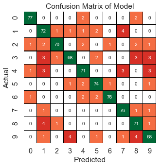

# Hand Written Digit Recognition using Neural Network via Keras
The dataset is a 1593 handwritten digits from around 80 persons were scanned, stretched in a rectangular box 16x16 in a gray scale of 256 values.
Using Artificial Neural Network (Keras Python Library), I am trying to find the numbers from the hand written digits.
I used `hyperas` for Neural Network Hyperparameter Tuning, and achieved an accuracy of **93.72%** in predicting the numbers from the handwritten images.

Source : https://archive.ics.uci.edu/ml/datasets/Semeion+Handwritten+Digit  
Confusion Matrix of the best model :

